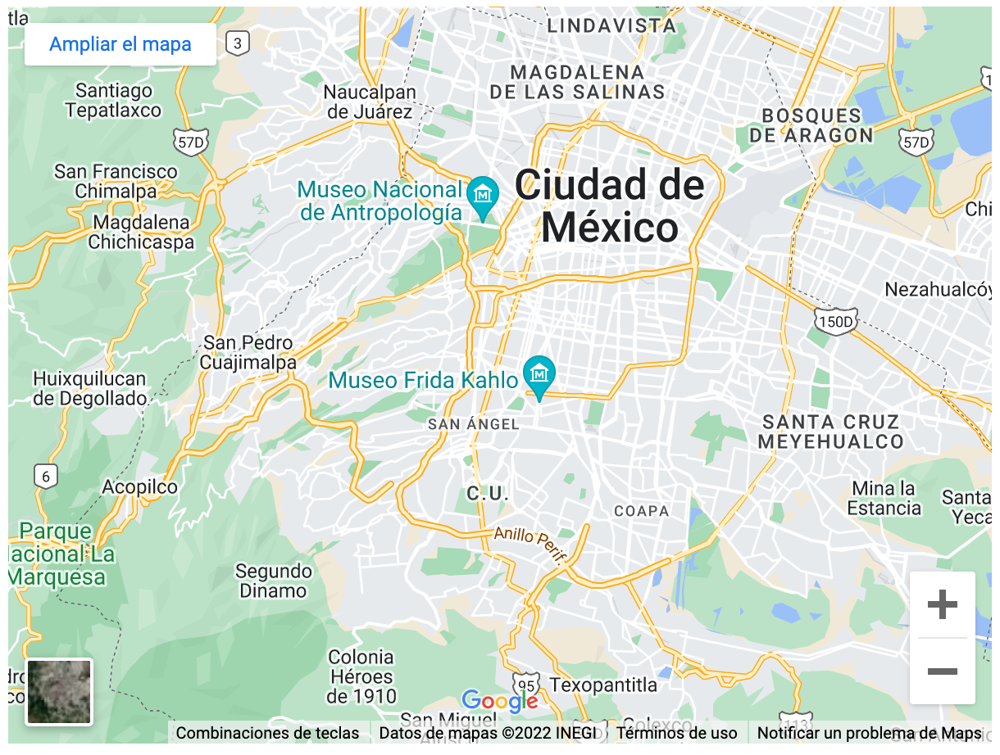

# Etiquetas de HTML

## `<iframe>`

Los elementos `<iframe>` están diseñados para permitirte incrustar documentos web en el documento actual. 

1. Primero, ve a Spotify (también puede ser Youtube) y encuentra el video que te gusta.
2. A un lado de la canción, encontraras un tres puntos (...): Da click y selecciona compartir.
3. Seleccione el botón Insertar pista y copia el código `<iframe>`.


```html
<!-- Código en HTML -->
<iframe style="border-radius:12px" src="https://open.spotify.com/embed/track/
6ESn78HoJcRVX6nCqewWtU?utm_source=generator" width="100%" height="380" 
frameBorder="0" allowfullscreen="" allow="autoplay; clipboard-write; encrypted-media; 
fullscreen; picture-in-picture">
</iframe>
```
   

`allowfullscreen`

Si está configurado, el  `<iframe>` se puede colocar en modo pantalla completa usando el  Full Screen API (El uso del API está fuera del alcance de este artículo.)


`frameborder`

Si se establece en 1, esto le indica al navegador que dibuje un borde entre este marco y otros marcos, que es el comportamiento predeterminado. 0 elimina el borde. Usar esto ya no es realmente recomendable, ya que el mismo efecto se puede lograr mejor usandoborder: none; en tu CSS.


`src`

Este atributo, como con `<video>/` ,contiene una ruta que apunta a la URL del documento que se va a incrustar.


`width and height`

Estos atributos especifican el ancho y la altura (width y height) que quieres que tenga el iframe.

<br>

Para obtener puntos de bonificación, también puede intentar insertar un mapa de Google en el ejemplo:

1. Ve a Google Maps y encuentra un mapa que te guste.
2. Haga clic en el "Menú Hamburger" (tres líneas horizontales) en la esquina superior izquierda de la IU.
3. Seleccione la opción Compartir o Insertar mapa .
4. Seleccione la opción Insertar mapa, que le dará un código `<iframe>` - copielo.


```html
<!-- Código en HTML -->
<iframe src="https://www.google.com/maps/embed?pb=!1m14!1m12!1m3!1d120450.
41251350164!2d-99.1789056!3d19.365888!2m3!1f0!2f0!3f0!3m2!1i1024!2i768!4f
13.1!5e0!3m2!1ses!2smx!4v1657924790446!5m2!1ses!2smx" width="600" height=
"450" style="border:0;"allowfullscreen="" loading="lazy" referrerpolicy=
"no-referrer-when-downgrade">
</iframe>
```
   